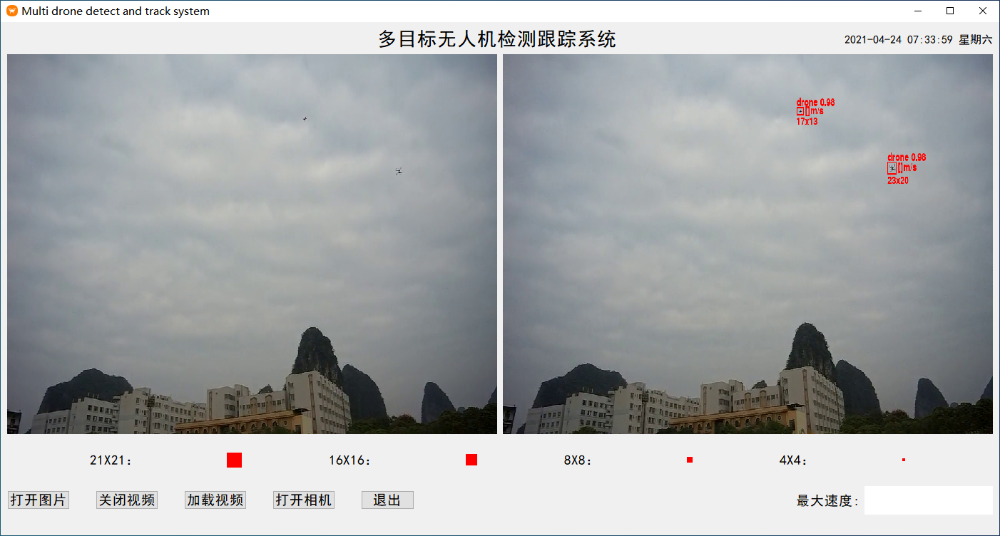
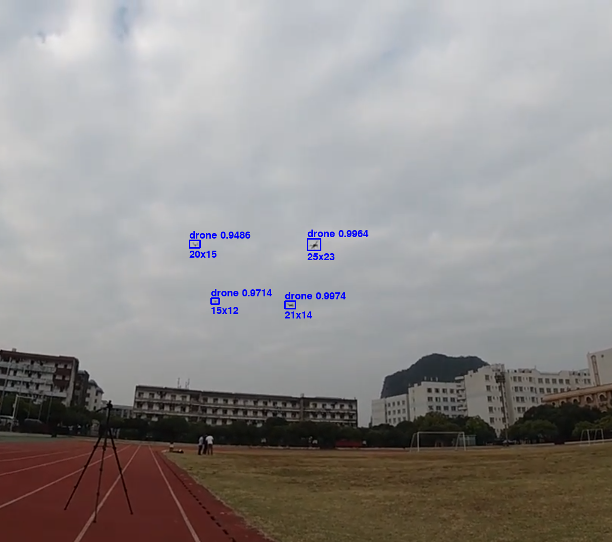
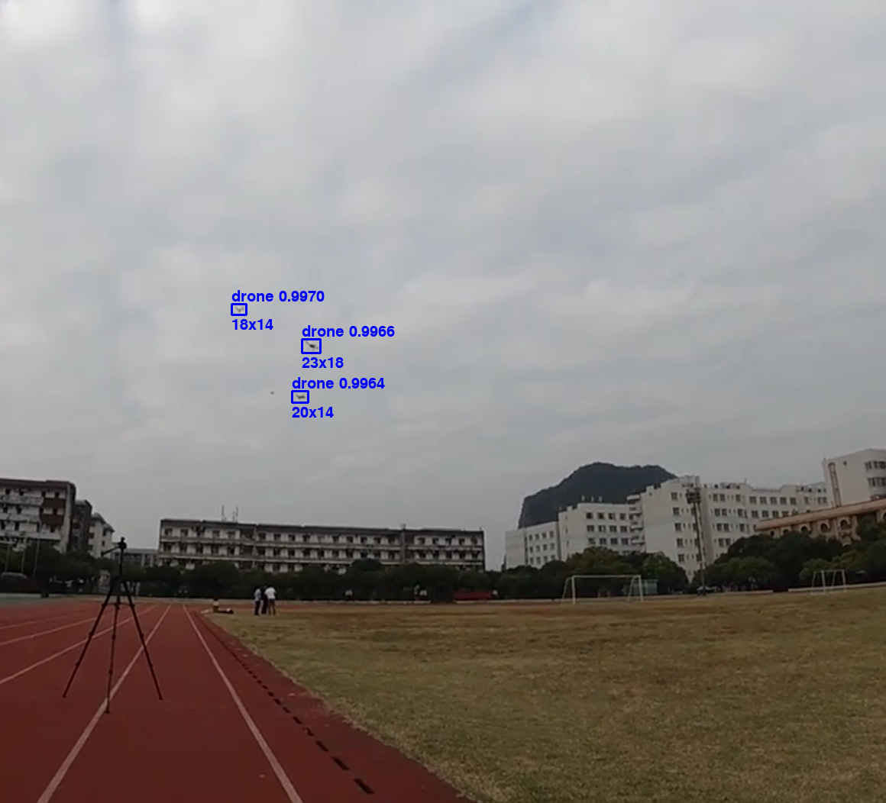
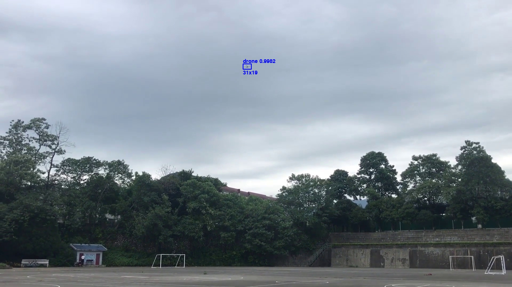
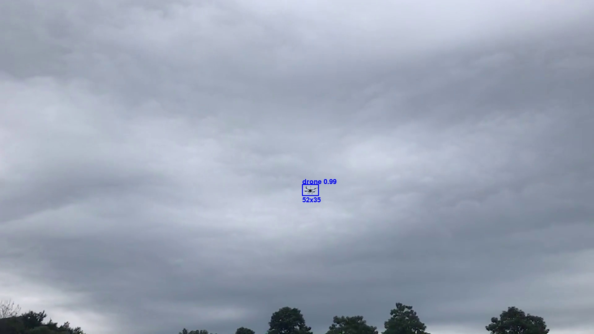
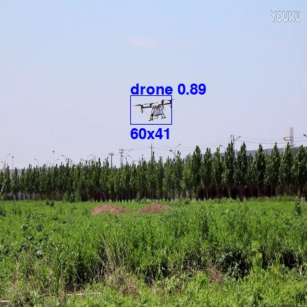

# multi-drone-detect-tracking

-   The detection end uses the current PP-YOLO model with a good balance of speed and accuracy, and improves the detection accuracy to 98.96% through improvements such as data enhancement and Mish activation function; in order to enable the system to detect in real time on platforms with limited computing capabilities, ResNet18 is used The backbone network speeds up, and the corresponding detection accuracy is 88.65%.
-   The tracking end adopts the DeepSORT algorithm to make the tracking more robust and reduce the tracking loss caused by occlusion and other reasons.
-   Pyqt is used for interface design, showing the effects of single image detection, video detection and tracking, and real-time camera tracking, realizing real-time tracking of 4 UAVs or more within 500 meters. The minimum detection size in the video test is 7×9 pixels.

## Main interface

## Result

## Image

The project is still in progress, and the code will be released later.

## About me

If you have any questions, please contact me via email [1765904103@qq.com].

